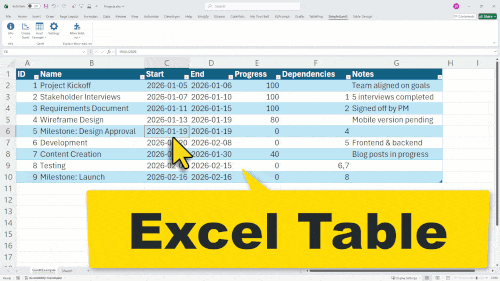

    <h1>SimpleGantt</h1>

**Create Excel Gantt Charts in Seconds**

  

[Get SimpleGantt](https://pythonandvba.com/simplegantt/) | [Documentation](https://pythonandvba.com/go/simplegantt-documentation/) | [Support](https://pythonandvba.com/go/simplegantt-support/)

## Turn Excel Tables into Interactive Gantt Charts

**SimpleGantt** is an Excel add-in that converts your task lists into professional, interactive Gantt charts with just one click. No formulas. No manual formatting. Just results.

### Why SimpleGantt?

- **One-Click Export**: Select your table, click export, done
- **Interactive Charts**: Zoom, scroll, and hover for details in any browser
- **Dependencies & Progress**: Visualize task relationships and completion status
- **Milestone Markers**: Highlight key dates and deadlines
- **Hour-Level Scheduling**: Perfect for workshops, conferences, and meeting agendas
- **Custom Branding**: Add your logo, colors, and titles (PRO)
- **100% Private**: Everything runs locally. Your data never leaves your computer

### Get Started

Download SimpleGantt for Excel:

**[https://pythonandvba.com/simplegantt/](https://pythonandvba.com/simplegantt/)**

Works with Excel 2007, 2010, 2013, 2016, 2019, 2021, and Microsoft 365 (Windows & Mac).

---

## Credits

This project is built on [Frappe Gantt](https://github.com/frappe/gantt), an open-source Gantt chart library by [Frappe Technologies](https://frappe.io).

## License

MIT License - see [LICENSE](https://github.com/Sven-Bo/gantt/blob/master/license.txt) for details.

---

**[SimpleGantt](https://pythonandvba.com/simplegantt/)** by [Sven Bosau](https://pythonandvba.com) | Powered by [Frappe Gantt](https://github.com/frappe/gantt)

